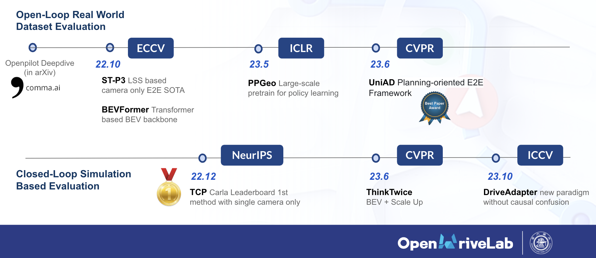

# DriveAdapter: New Paradigm for End-to-End Autonomous Driving to Alleviate Causal Confusion

> **DriveAdapter: Breaking the Coupling Barrier of Perception and Planning in End-to-End Autonomous Driving**
> - [arXiv Paper](https://arxiv.org/abs/2308.00398), accepted at ICCV 2023
> 
>   
## Getting Started

- [Installation](docs/INSTALL.md)
- [Closed-Loop Evaluation in Carla](docs/EVAL.md)
- [Prepare Dataset](docs/DATA_PREP.md)
- [Train Your Own Model](docs/TRAIN.md)
- [Calibrations for Different Camera Settings](camera_calibration/README.md) (Optional)

## Quick Run in Carla

- Install the environment as stated in [Installation](docs/INSTALL.md)
- Download the checkpoint
  - `189K frames Training Set`: [GoogleDrive](https://drive.google.com/file/d/1ezaOmsz0lwuWckiJtBIDkhviOS35oEhZ/view?usp=sharing) or [BaiduYun](https://pan.baidu.com/s/1mxImkL5TiPgdoegbwCDglg?pwd=9xou)(提取码 9xou)
  - `2M frames Training Set`: [GoogleDrive](https://drive.google.com/file/d/1IFyRftYFg72AxoSePrW2oTg-cH4l3MFV/view?usp=sharing) or [BaiduYun](https://pan.baidu.com/s/1EcYuftXpbLTnm-FMCq1Umg?pwd=g6ki)(提取码 g6ki)
- Put it into **open_loop_training/ckpt**, and run:

```shell
## In the DriveAdapter/ directory
CUDA_VISIBLE_DEVICES=0 nohup bash ./leaderboard/scripts/evaluation_town05long.sh 22023 22033 driveadapter_agent  False True open_loop_training/ckpt/driveadapter_2m.pth+open_loop_training/configs/driveadapter.py all_towns_traffic_scenarios_no256 driveadapter_town05long 2>&1 > driveadapter_town05long.log &
```

Check [closed_loop_eval_log/eval_log](closed_loop_eval_log/eval_log) to see how our model drives in Carla! :oncoming_automobile:

> In case you have a screen to see the interface of Carla simulator, you could remove *`DISPLAY=`* in [leaderboard/leaderboard/leaderboard_evaluator.py](leaderboard/leaderboard/leaderboard_evaluator.py) and then you could watch with Carla straight ahead. 


## Code Structure

We give the structure of our code. Note that we only introduce those folders/files are commonly used and modified.

    DriveAdapter/
    ├── agents                  # From Carla official
    ├── camera_calibration      # When you want to use cameras with different FOV
    ├── closed_loop_eval_log    # Save eval logs
    ├── collect_data_json       # Save data collection logs
    ├── dataset                 # Data and metadata for training
    ├── leaderboard             # Code for Closed-Loop Evaluation
    │   ├── data                    # Save routes and scenarios
    │   ├── scripts                 # Run with Carla
    │   ├── team_code               # Your
    |   |   ├── roach_ap_agent_data_collection.py # Data collection
    │   |   └── driveadapter_agent.py      # Interface for closed-loop evaluation of our model
    │   ├── leaderboard             # From Carla official
    |   |   └── leaderboard_evaluator.py # Entrance of closed-loop evaluation
    ├── roach                   # Roach for data collection
    ├── scenario_runner         # From Carla official
    ├── open_loop_training      # Training and Neural Network
    |    ├── ckpt                    # Checkpoints
    |    ├── work_dirs               # Training Log
    |    ├── code                    # Preprocessing, DataLoader, Model
    |    │   ├── apis                    # Training pipeline for mmdet3D
    |    │   ├── core                    # The hooks for mmdet3D
    |    │   ├── datasets                # Preprocessing and DataLoader
    |    |   |   ├── pipelines                # Functions of Preprocessing and DataLoader
    |    │   |   ├── samplers                 # For DDP
    |    │   |   └── carla_dataset.py         # Framework of Preprocessing and DataLoading
    |    │   ├── model_code                   # Neural Network
    |    |   |   ├── backbones                # Module of Encoder
    |    |   |   └── dense_heads              # Module of Decoder and Loss Functions
    |    │   └── encoder_decoder_framework.py # Entrance of Neural Network
    |    └── train.py                # Entrance of Training

## License

All assets and code are under the [Apache 2.0 license](./LICENSE) unless specified otherwise.

## Bibtex
If this work is helpful for your research, please consider citing the following BibTeX entry.

```
@inproceedings{jia2023driveadapter,
  title={DriveAdapter: Breaking the Coupling Barrier of Perception and Planning in End-to-End Autonomous Driving},
  author={Jia, Xiaosong and Gao, Yulu and Chen, Li and Yan, Junchi and Liu, Patrick Langechuan and Li, Hongyang},
  booktitle={ICCV},
  year={2023}
}
```

DriveAdapter is developed based on our prior work [ThinkTwice](https://github.com/OpenDriveLab/ThinkTwice), 
have a look if you are interested and please consider citing if you find it helpful:
```
@inproceedings{jia2023thinktwice,
  title={Think Twice before Driving: Towards Scalable Decoders for End-to-End Autonomous Driving},
  author={Jia, Xiaosong and Wu, Penghao and Chen, Li and Xie, Jiangwei and He, Conghui and Yan, Junchi and Li, Hongyang},
  booktitle={CVPR},
  year={2023}
} 
```

## One More Thing: End-to-End Autonomous Driving 
### From an OpenDriveLab Perspective
 


Check out the latest [End-to-end Autonomous Driving Survey](https://github.com/OpenDriveLab/End-to-end-Autonomous-Driving) 
for more information!


## Related Resources
Many thanks to the open-source community!

[](https://awesome.re)
- [ThinkTwice](https://github.com/OpenDriveLab/ThinkTwice) (:rocket:Ours!)
- [End-to-end Autonomous Driving Survey](https://github.com/OpenDriveLab/End-to-end-Autonomous-Driving) (:rocket:Ours!)
- [TCP](https://github.com/OpenDriveLab/TCP) (:rocket:Ours!)
- [PPGeo](https://github.com/OpenDriveLab/PPGeo) (:rocket:Ours!)
- [BEVFormer](https://github.com/fundamentalvision/BEVFormer) (:rocket:Ours!)
- [UniAD](https://github.com/OpenDriveLab/UniAD) (:rocket:Ours!)
- [ST-P3](https://github.com/OpenDriveLab/ST-P3) (:rocket:Ours!)
- [Carla](https://github.com/carla-simulator/carla)
- [Roach](https://github.com/zhejz/carla-roach)
- [BEVFusion](https://github.com/mit-han-lab/bevfusion)
- [Mask2Former](https://github.com/facebookresearch/Mask2Former)
- [BEVDepth](https://github.com/Megvii-BaseDetection/BEVDepth)
- [Transfuser](https://github.com/autonomousvision/transfuser)
- [LAV](https://github.com/dotchen/LAV)
- [IBISCape](https://github.com/AbanobSoliman/IBISCape)
